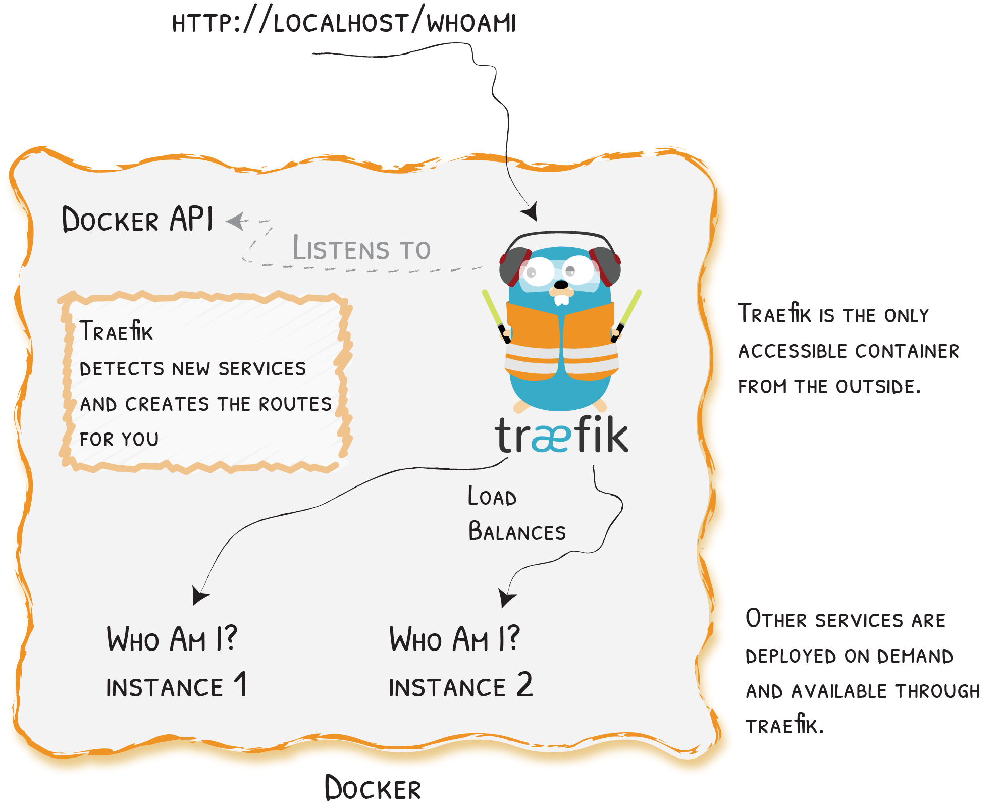
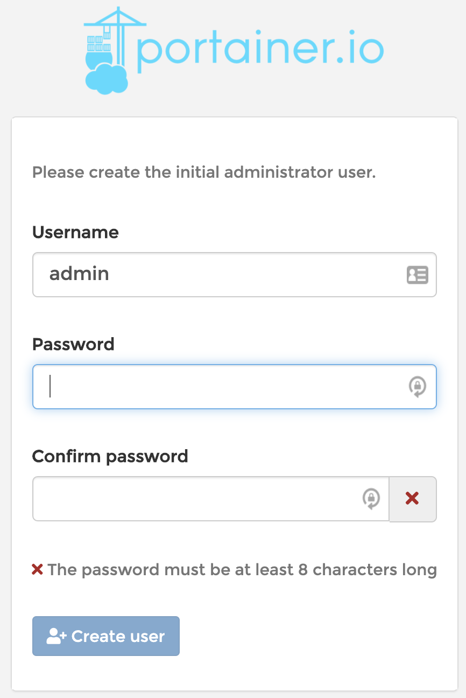

# Teaching-HEIGVD-RES-2020-Labo-HTTPInfra

> Students: Bonzon Ludovic & Kayoumi Doran
>
> Date: 01.05.2020

All of our work can be found on [this repo](https://github.com/bonzonlu/Teaching-HEIGVD-RES-2020-Labo-HTTPInfra/tree/fb-apache-static)

## Configuration used for this lab

We've used two different work environments:

|                                                              |                                                              |
| ------------------------------------------------------------ | ------------------------------------------------------------ |
|  |  |

## Step 1 - Static HTTP server with apache httpd

In this first set we will setup a static Apache HTTP server with Docker.

### Dockerfile

```dockerfile
FROM php:7.4.5-apache
COPY content/ /var/www/html/
```

We've based our docker image on the official [php](https://hub.docker.com/_/php) image with the **Apache** variant version **7.4.5**. We could have directly used Apache [official](https://hub.docker.com/_/httpd) image, but since we'll be needing php in further steps, we've decided to use php since it comes with an Apache server already configured.

Then we've configured our image to copy the contents of `content/` (our cool website) to `/var/www/html` on the server.

### Apache configuration

All of Apache configuration files can be found in `/etc/apache2`:

```
apache2.conf
conf-available
conf-enabled
envvars
magic
mods-enabled
mods-available
ports.conf
sites-available
sites-enabled
```

- **apache2.conf**: This is the main configuration file for the server.
- **ports.conf**: This file is used to specify the ports that virtual hosts should listen on.
- **conf.d/**: This directory is used for controlling specific aspects of the Apache configuration.
- **sites-available/**: This directory contains all of the virtual host files that define different web sites. These will establish which content gets served for which requests.
- **sites-enabled/**: This directory establishes which virtual host definitions are actually being used. This directory consists of symbolic links to files defined in the "sites-available" directory.
- **mods-[enabled,available]/**: These directories are similar in function to the sites directories, but they define modules that can be optionally loaded instead.

In the **sites-available** folder we can find the default Virtual host configuration.

```
<VirtualHost *:80>
  # The ServerName directive sets the request scheme, hostname and port that
  # the server uses to identify itself. This is used when creating
  # redirection URLs. In the context of virtual hosts, the ServerName
  # specifies what hostname must appear in the request's Host: header to
  # match this virtual host. For the default virtual host (this file) this
  # value is not decisive as it is used as a last resort host regardless.
  # However, you must set it for any further virtual host explicitly.
  #ServerName www.example.com

  ServerAdmin webmaster@localhost
  DocumentRoot /var/www/html

  # Available loglevels: trace8, ..., trace1, debug, info, notice, warn,
  # error, crit, alert, emerg.
  # It is also possible to configure the loglevel for particular
  # modules, e.g.
  #LogLevel info ssl:warn

  ErrorLog ${APACHE_LOG_DIR}/error.log
  CustomLog ${APACHE_LOG_DIR}/access.log combined

  # For most configuration files from conf-available/, which are
  # enabled or disabled at a global level, it is possible to
  # include a line for only one particular virtual host. For example the
  # following line enables the CGI configuration for this host only
  # after it has been globally disabled with "a2disconf".
  #Include conf-available/serve-cgi-bin.conf
</VirtualHost>
```

Normally when a new site is added to the server you should create a new configuration file and then create a symbolic link in **sites-available** so that the website will be served by the web server.

Since our server will only host one website, we've decided not to create a custom configuration file and just copy our website in the **DocumentRoot** set in the default config i.e. `/var/www/html`.

### Setup

To start using our website, you'll need to run the following:

```bash
docker build --tag res/apache_php .
docker run -d --rm -p 9090:80 --name static-http res/apache_php
```

You'll then be able to access the website at `localhost:9090`.

### Usage


Here we can see that we built and run the Docker container using the scripts, then showed the running containers. In the background we can see the web page up and running on `localhost:9090`.

## Step 2: Dynamic HTTP server with express.js

In this set we will write an HTTP app in Node.js capable of returning a JSON payload on GET requests and also learn to use Postman to test HTTP apps.

### Dockerfile

```dockerfile
FROM node:12.16.3

# create the directory for our cool app
WORKDIR /opt/app

# install the dependencies for our app
## first copy `package.json` and `package-lock.json`
COPY src/package*.json ./
## then we can install the dependencies w/ npm
RUN npm i

# bundle the app
COPY src .

# run the app
CMD ["node", "index.js"]

```

We've based our docker image on the official [**NodeJS**](https://hub.docker.com/_/node) image in version **12.16.3**.

The first thing we did is to create our server side working directory in `/opt/app` . Then we install the dependencies of our (cool) app by copying the `package.json` and `package-lock.json` to the server and then running `npm i` (this is a shortcut for `npm install`, since we're lazy, we've decided to use it...don't judge!).

Once the dependencies installed, we can copy our app to the server.

And last but not least, we can run our app (which is very cool) using `node index.js`.

>  Note: We've added a `.dockerignore` file to avoid copying the `node_modules` to the server. This is to prevent any issues if we've installed local modules that aren't needed for the app. This isn't the case here..but better be safe than sorry.

[Source](https://nodejs.org/fr/docs/guides/nodejs-docker-webapp/)

### Setup

To start using our app (or improve it), you'll need to run the following commands:

```bash
docker build -t res/express .
docker run -d -p 9090:3000 --name dynamic-http res/express
```

You'll then be able to access the app on `localhost:9090`. Pretty cool right?

>Note: If you decided to improve our application, you'll need to rebuild the image and create a new container (i.e. you'll have to rerun the above commands :sweat:) every time you do any changes.

### Application

For our application we've used the minimalist yet awesome framework [express.js](https://expressjs.com/) and the [Chance.js](https://chancejs.com/index.html) library. Our app will generate random user profiles and hashtags and return them in the JSON format.

You can can generate them using the following `GET` routes:

* `/hashtag`
* `/profile`
* `/profile/:count`

> Note: `:count` is the number of profiles you wish to create.

### Usage

Here are some example of usage of our application.

#### Telnet

```bash
$ telnet localhost 9090
Trying ::1...
Connected to localhost.
Escape character is '^]'.
GET /profile HTTP/1.0

HTTP/1.1 200 OK
X-Powered-By: Express
Content-Type: application/json; charset=utf-8
Content-Length: 181
ETag: W/"b5-KZ+dCpUE8D2y8w8sSTFGI043wP0"
Date: Fri, 08 May 2020 16:35:29 GMT
Connection: close

{"name":"Franklin Fowler","gender":"Male","pet":"Hedgehogs","email":"goc@fozazuko.nc","avatar":"https://www.gravatar.com/avatar/7a408e854b2687dfcc550f9f399f149a","hashtag":"#amapi"}
Connection closed by foreign host.
```

#### Browser


#### Postman


## Step 3: Reverse proxy with apache (static configuration)

In this step we're going to setup an apache reverse proxy. It's purpose is to sit between out HTTP servers and external clients, forwarding client requests to the appropriate server.

### Dockerfile

```dockerfile
FROM php:7.4.5-apache

# copy our configurations to the server
COPY conf/ /etc/apache2

# enable the proxy modules & our sites
RUN a2enmod proxy proxy_http
RUN a2ensite 000-* 001-*
```

Our Dockerfile is pretty straight forward. Same as for [step 1](#step-1---static-http-server-with-apache-httpd), we've based our docker image on the official [php](https://hub.docker.com/_/php) image with the **Apache** variant version **7.4.5**. Then we copied the virtual hosts we created for our reverse proxy. Finally, we enable the modules needed to use a proxy and our websites.

#### Virtual hosts

```
# 000-default.conf
<VirtualHost *:80>
</VirtualHost>
```

We've setup an empty default virtual to restrict the access to our servers. By doing this, if someone tries to access our services without specifying the host defined in the reverse proxy virtual host, he'll be redirected to the default one and get an error message.

```
# 001-reverse-proxy.conf
<VirtualHost *:80>
  ServerName res.summer-adventure.io

  # API
  ProxyPass "/api/" "http://172.17.0.3:3000/"
  ProxyPassReverse "/api/" "http://172.17.0.3:3000/"

  # Website
  ProxyPass "/" "http://172.17.0.2/"
  ProxyPassReverse "/" "http://172.17.0.2/"

</VirtualHost>
```

This is the virtual host that will be used for our reverse proxy. The first thing we did is specify a `ServerName` so that our server will only accept requests with that name set in the `Host` part of the HTTP header.

Next we've configured 2 `ProxyPass`, one for the API and the second for the static website. Their purpose is to redirect the requests to the correct server. If they start by `/api/`, they'll will be redirected to the dynamic HTTP server otherwise, they'll be redirected to the static HTTP server.

> Note: There's one big issue with this configuration. It's that we've "hard coded" the IP addresses of our servers. This is a problem because we do not know what addresses docker will give to our servers.

### Setup

As we've stated above, there could be an issue with the IP addresses since they're hardcoded :flushed:. Before running the reverse proxy, you'll need to have both HTTP servers up and running before hand. You can follow their respective setup instructions [here](#setup) and [here](#setup-1).

> Note: You don't need to do any port forwarding.

Next, you'll need to check the IP addresses of both containers and if need be, edit the reverse proxy configuration.

```bash
docker inspect static-http | grep IPA
docker inspect dynamic-http | grep IPA
```

If you have a big sad moment and the IP addresses aren't the same as the ones we've configured, you'll have to edit the reverse proxy configuration (`001-reverse-proxy.conf`) and change the IP addresses.

> Note: You'll have to copy the content of `example-reverse-proxy.conf` in `001-reverse-proxy.conf`. The files can can be found here:
> `docker-images/reverse-proxy/conf/sites-available`

Once you have the configuration files sorted, all that is left to do is build and run the reverse proxy. You can run the following:

```bash
docker build --tag res/reverse-proxy .
docker run -d --rm -p 9090:80 --name reverse-proxy res/reverse-proxy
```

And voila, you have the reverse proxy and both HTTP servers up and running.

If you want to be able to use the services, you'll need update your `hosts` file and add the following:

> The location of the `hosts` file depends on your system:
>
> * For UNIX based systems the file is located at `/etc/hosts`.
>
> * For Windows (why?) the is located at `C:\Windows\System32\drivers\etc\hosts`
>
> Note: You'll need to open the file with admin/root privileges

```
<ip> res.summer-adventure.io
```

The value of **<ip>** depends on your system. If you are using Linux, you can simply put `127.0.0.1`. On Windows and MacOS, you'll need to put the IP address of the Docker virtual machine.

You can now access the services at `res.summer-adventure.io:9090`.

#### Possible improvements

As we've stated above, there could be issues with the IP addresses of our servers. To solve these issues, we've created scripts to generate the VirtualHost so you won't need to worry does pesky IP addresses and to start up the proxy server.

To start the reverse proxy you can simply run:

```bash
./start_rproxy
```

> Note: You need to be in the same directory as **start_proxy** and keep our directory structure for it to work

Same as before, you'll need to update the hosts file.


An even better solution, would be to use [docker-compose](https://docs.docker.com/compose/) to manage our containers.

We'll start by defining our services in a `docker-compose.yml` file.

```yaml
version: "3.8"
services:
  static-http:
    build: ./docker-images/apache-php-image/
    container_name: static-http

  dynamic-http:
    build: ./docker-images/express-image/
    container_name: dynamic-http

  reverse-proxy:
    build: ./docker-images/reverse-proxy
    container_name: reverse-proxy
    ports:
      - 8080:80
```

Then in the reverse proxy VirtualHost, the IP addresses can be replaced with the name of the services. Like this:

> Note: You can to copy the content of `example-compose-reverse-proxy.conf` in `001-reverse-proxy.conf`.

```
<VirtualHost *:80>
  ServerName res.summer-adventure.io

  # API
  ProxyPass "/api/" "http://dynamic-http:3000/"
  ProxyPassReverse "/api/" "http://dynamic-http:3000/"

  # Website
  ProxyPass "/" "http://static-http/"
  ProxyPassReverse "/" "http://static-http/"
</VirtualHost>
```

To startup everything, simply run the following:

> Note: You need to be in the same directory as the `docker-compose.yml` file.

```bash
docker-compose up -d
```

And again, you'll need to update the hosts file.

### Usage

To access the dynamic server, you'll need to add `/api/` to your requests.
E.g. `res.summer-adventure.io/api/hashtags/`

#### Telnet

```bash
$ telnet localhost 8080
Trying ::1...
Connected to localhost.
Escape character is '^]'.
GET /profile HTTP/1.0

GET /api/hashtag HTTP/1.0
Host: res.summer-adventure.io # <- Without this, it won't work and you'll be big sad

HTTP/1.1 200 OK
Date: Sat, 09 May 2020 15:17:57 GMT
Server: Apache/2.4.38 (Debian)
X-Powered-By: Express
Content-Type: text/html; charset=utf-8
Content-Length: 3
ETag: W/"3-eAlk7ARQltRrcHu3KndCCIaNG2M"
Connection: close

#ju
```

#### Browser


## Step 4: AJAX requests

In this step. we're going to create a javascript script to fetch `hashtags` from our API with **AJAX**. We opted **not** to use JQuery because plain old JavaScript has evolved so much that it is now very easy to make AJAX queries and interact with the DOM.

> Note: Nowadays, web apps are developed using frontend frameworks such as Vue.Js (:heart:), React and Angular.

```javascript
// docker-images/apache-php-image/content/js/app.js

// get the div where the hastag will be written
const target = document.getElementById('hashtag');

// fetch the first hashtag
fetchHashtag();
// update it every 3 seconds
setInterval(fetchHashtag, 3000);

/**
 * Fetch a hashtag from the API
 */
function fetchHashtag() {
  fetch("/api/hashtag/")
    // convert the response to json
    .then((res) => res.json())
    .then((data) => {
      target.innerHTML = data;
    })
    .catch(() => {
      console.log("API unreachable");
    });
}
```

Every 3 seconds, a `GET` request is made to the API to get a new hashtag and update the DOM.


## Step 5: Dynamic reverse proxy configuration



For this step, we will deviate from the webcasts, follow our own path and use a cool tool called [Traefik](https://docs.traefik.io/) which is (as described in their own terms) *an open-source Edge Router that makes publishing our services a fun and easy experience*. It is also natively compliant with Docker. We will reuse the Docker containers created in [step 3](#step-3-reverse-proxy-with-apache-static-configuration) but avoid the hassle of hardcoding manual IP addresses or creating scripts.

### Setup

As stated in the [possible improvements section in step 3](#possible-improvements), Docker-compose is the tool we're going to use. Depending on how you use Docker on your system, you might have to install `docker-compose`. If you're using Docker Desktop for MacOS or Windows, it's built in so you won't need to install it. If you're running Linux, you'll have to install it. You can have a look [here](https://docs.docker.com/compose/install/) to see how to install it.


So first off we are going to create a simple `docker-compose.yml` file listing our services :

```yaml
# docker-compose.yml
version: "3.8"
services:
  static-http:
    build: ../apache-php-image/

  dynamic-http:
    build: ../express-image/

  reverse-proxy:
    ports:
      - 80:80
      - 8080:8080
```

We declare two services `static-http` for our website and `dynamic-http` for our random generator APIs, and set up a few ports for our `reverse proxy`.  Now we can add a third container using the Traefik image and start configuring for our reverse proxy.

 ```yaml
# ....
    reverse-proxy:
        image: traefik
        ports:
          # The HTTP port
          - 80:80
          # The Web UI (enabled by --api.insecure=true)
          - 8080:8080
        command:
          # Enables the web UI
          - "--api.insecure=true"
          # Tells Traefik to use Docker as a provider
          - "--providers.docker"
          # Defines an entrypoint, "web", listening on port 80
          - "--entrypoints.web.address=:80"
          # Ignores non-enabled services (with the "traefik.enable=true" rule)
          - "--providers.docker.exposedbydefault=false"
        volumes:
          # So that Traefik can listen to the Docker events
          - /var/run/docker.sock:/var/run/docker.sock
 ```

Traefik is configured, all we need to do now, is configure our HTTP servers with a little Traefik magic so the reverse proxy can redirect the requests correctly.

```yml
static-http:
build: ../apache-php-image/
labels:
    # Enables the service in Traefik
    - "traefik.enable=true"
    # Sets the port to 80 for this service
    - "traefik.port=80"
    # Allows connection via the url "res.summer-adventure.io"
    - "traefik.http.routers.static-http.rule=Host(`res.summer-adventure.io`)"
    # Sets the entrypoint to the one declared later on
    - "traefik.http.routers.static-http.entrypoints=web"
```

```yml
dynamic-http:
    build: ../express-image/
    labels:
      # Enables the service in Traefik
      - "traefik.enable=true"
      # define the host to `res.summer-adventure.io` and add a PathPrefix so
      # this service is only accessible if it's present
      # "res.summer-adventure.io/api"
      - "traefik.http.routers.dynamic-http.rule=Host(`res.summer-adventure.io`) && PathPrefix(`/api`)"
      # the api doesn't have the "api" prefix in the routes it offers
      # so we need to remove it
      - "traefik.http.routers.dynamic-http.middlewares=strip-prefix"
      - "traefik.http.middlewares.strip-prefix.stripprefix.prefixes=/api"
      # the dynamic server listens on the port 3000, so we tell traefik
      # to redirect the requests there
      - "traefik.http.services.dynamic-http.loadbalancer.server.port=3000"
```

Our reverse proxy is now configured, all we need to do is run the following to start our services:

```bash
docker-compose up -d
```

### Usage

Traefik offers a built-in dashboard with a lot of useful information on entrypoints, routers, services and middlewares for HTTP, TCP and UDP protocols. The page is accessible on the `8080` port, so if we type in `res.summer-adventure.io:8080` in our favourite web browser, we land on the following page :


Our super duper website is now accessible at `res.summer-adventure.io` and our top notch APIs at `res.summer-adventure.io/api`

> Reminder: Existing entry points of our API are:
>
> * /hashtag
> * /profile
> * /profile/:count


Shaun :sheep: is still here !


And so is Donald Young !

## Additional 1 - Load balancing: multiple server nodes

A cool thing about Traefik, is that it comes with a [load balancer](https://docs.traefik.io/getting-started/quick-start/#more-instances-traefik-load-balances-them)  using a [Round Robin](https://docs.traefik.io/routing/services/#load-balancing) implementation. All we need to do is startup multiple instances of our servers and see Traefik do it's magic.

With the following, we'll start all of our services and have multiple instances of our HTTP servers.

```bash
docker-compose up --scale static-http=2 --scale dynamic-http=3
```

We immediately see the result of the command :


And in the dashboard interface that we have 2 servers/nodes dedicated to handle static requests and 3 servers/nodes for the dynamic ones :


Below is a list of the servers IP addresses and Ports for both services :

| Static HTTP service                                       | Dynamic HTTP service                                        |
| --------------------------------------------------------- | ----------------------------------------------------------- |
|  |  |

To test the load balancing, we've added a simple php script in our static server to see the IP address of the server that's serving the web page.

```php
<?php
# server.php
echo $_SERVER['SERVER_ADDR'];
```

Then we can access the script at `res.summer-adventure.io/server.php`. By refreshing the page, we can see the IP address changing, meaning that the requests are balanced between our static HTTP services.


## Additional 2 - Load balancing: round-robin vs sticky sessions

Traefik offers a simple solution to enable sticky sessions. All we need to do is add the following in the configuration of the static server in the `docker-compose.yml`.

```yml
# docker-compose.yml
static-http:
# ...
    labels:
    # ...
    - "traefik.http.services.static-http.loadbalancer.sticky.cookie=true"
```


To test the load balancing, we've updated the API in our dynamic server to return the IP address of the server that's serving the web page. Below is the code we added in the index page of our JS API :

```javascript
// docker-images/express-image/src/index.js
// ...
const ip = require('ip')
// ...
app.get('/', (req, res) => {
  res.send(`Welcome to our app! This service is being served by ${ip.address()}`);
});
// ...
```

> Note: We've added the [ip package](https://www.npmjs.com/package/ip) to our package list using the previous command. It contains IP address utilities for node.js
>
> ```bash
> $ npm install ip
> ```

If we access the dynamic HTTP server, we can notice that round-robin load balancing still works :fire:


> Note: We don't know why the IP addresses changed to 192.168.x.y

## Additional 3 - Dynamic cluster management

Dynamic cluster management is also a built-in feature in Traefik. For it to work, we need to let Traefik listen to the Docker socket. All we need to map the docker socket of our machine with the reverse proxy container. We can to this by using a volume. We've already configured it while [setting up the reverse proxy](#setup-3) , but here's what it looks like:

```yml
# docker-compose.yml
reverse-proxy:
  # ...
  volumes:
    # So that Traefik can listen to the Docker events
    - /var/run/docker.sock:/var/run/docker.sock
```

With Traerfik listening to the Docker socket, whenever we start or kill a container, it will automatically be detected and the reverse proxy, and the load balancer will be dynamically updated to reflect the cluster's state. This is all based on the [Auto Service Disovery](https://docs.traefik.io/getting-started/concepts/#auto-service-discovery) principle of Traefik : "*When a service is deployed, Traefik detects it immediately and updates the routing rules in real time. The opposite is true: when you remove a service from your infrastructure, the route will disappear accordingly.*"

### Usage

First we need to have our services up and running

```bash
$ docker-compose up -d
```

If we check Traefik' dashboard we can see everything is running.


Now we can use the `--scale` option to add more servers

```bash
$ docker-compose up -d --scale static-http=2
dynamic-reverse-proxy_reverse-proxy_1 is up-to-date
Starting dynamic-reverse-proxy_static-http_1 ...
Starting dynamic-reverse-proxy_static-http_1 ... done
Creating dynamic-reverse-proxy_static-http_2 ... done
```

We can see that newly created are being handled by Traefik.


Lets add more dynamic servers.

```bash
$ docker-compose up -d --scale static-http=2 --scale dynamic-http=5
dynamic-reverse-proxy_static-http_1 is up-to-date
dynamic-reverse-proxy_static-http_2 is up-to-date
dynamic-reverse-proxy_reverse-proxy_1 is up-to-date
Starting dynamic-reverse-proxy_dynamic-http_1 ... done
Creating dynamic-reverse-proxy_dynamic-http_2 ... done
Creating dynamic-reverse-proxy_dynamic-http_3 ... done
Creating dynamic-reverse-proxy_dynamic-http_4 ... done
Creating dynamic-reverse-proxy_dynamic-http_5 ... done
```

> Note: We have to repeat `--scale static-http=2` otherwise it will revert to default number of containers. In our case 1.


It also works when we stop services

```bash
$ docker kill dynamic-reverse-proxy_dynamic-http_3
```


## Additional 4 - Management UI

For this step, we've decided to not reinvent the wheel and look for an existing management UI. After hours and hours of research (for real it took us max 5 min to find one), we found [Portainer](https://www.portainer.io/). It's an open source (yay) tool to facilitate the management of a Docker environment.

The deployment is pretty simple. Portainer comes as a standalone Docker container, and can be setup with the following :

```bash
$ docker volume create portainer_data
$ docker run -d -p 18000:8000 -p 19000:9000 --name=portainer --restart=always -v /var/run/docker.sock:/var/run/docker.sock -v portainer_data:/data portainer/portainer
```

Or using a dedicated `docker-compose.yml` file such as the following :

```yaml
# docker-images/manager/docker-compose.yml
version: "3.8"
services:
  portainer:
    image: portainer/portainer
    restart: always
    ports:
      - 19000:9000
      - 18000:8000
    volumes:
      - /var/run/docker.sock:/var/run/docker.sock
      - portainer_data:/data
```

When accessing the port `19000` of the Docker engine where Portainer is running using a web browser for the first time, in our case `res.summer-adventure.io:19000/`, we are greeted with a form to create the initial administrator user.



Then we need to select the Docker environment we want to manage through Portainer.


In our case, we want to manage our local Docker environment, so we've selected `local` and made sure that we've setup the Portainer 'container correctly.


And ta-da ! We arrive on the home page of Portainer. It displays the available endpoints and a few info about it (name, number of stacks and containers, number of running and stopped containers, etc...)

We can click on it and land on the dashboard interface of the local endpoint. On the left pane is a list of the elements we can interact with.


Stacks will...well...display the list of stacks, if we click on `dynamic-reverse-proxy`, we can view all the containers of this particular stack and manage them (start, stop, kill, restart, pause, resume and remove).


This toolset seems very powerful and complete, offers a handful of monitoring and administration features, but we will not explain much more about it, the UI is pretty and easy to use and the [Portainer documentation]() is also a good starting point to seek resources.

