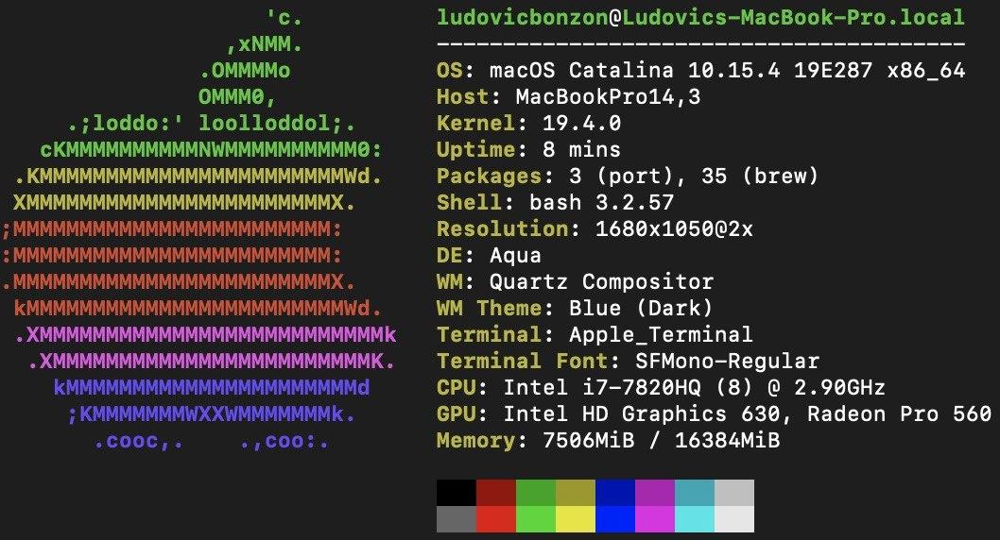

# Teaching-HEIGVD-RES-2020-Labo-HTTPInfra

Students:

* Bonzon Ludovic
* Kayoumi Doran

All of our work can be found on [this repo](https://github.com/bonzonlu/Teaching-HEIGVD-RES-2020-Labo-HTTPInfra/tree/fb-apache-static)

## Configuration used for this lab

We've used two different work environments:




## Step 1 - Static HTTP server with apache httpd

In this first set we will setup a static Apache HTTP server with Docker.

### Dockerfile

```dockerfile
FROM php:7.4.5-apache
COPY content/ /var/www/html/
```

We've based our docker image on the official [php](https://hub.docker.com/_/php) image with the **Apache** variant version **7.4.5**. We could have directly used Apache [official](https://hub.docker.com/_/httpd) image, but since we'll be needing php in further steps, we've decided to use php since it comes with an Apache server already configured.

Then we've  configured our image to copy the contents of `content/` (our cool website) to `/var/www/html` on the server.

### Apache configuration

All of Apache configuration files can be found in `/etc/apache2`:

```
apache2.conf
conf-available
conf-enabled
envvars
magic
mods-enabled
mods-available
ports.conf
sites-available
sites-enabled
```

- **apache2.conf**: This is the main configuration file  for the server. 
- **ports.conf**: This file is used to specify the ports that virtual hosts should listen on. 
- **conf.d/**: This directory is used for controlling  specific aspects of the Apache configuration. 
- **sites-available/**: This directory contains all of  the virtual host files that define different web sites.  These will  establish which content gets served for which requests.  
- **sites-enabled/**: This directory establishes which  virtual host definitions are actually being used.  This directory consists of symbolic links to files defined in the "sites-available" directory.
- **mods-[enabled,available]/**: These directories are  similar in function to the sites directories, but they define modules  that can be optionally loaded instead.

In the **sites-available** folder we can find the default Virtual host configuration.

```
<VirtualHost *:80>
	# The ServerName directive sets the request scheme, hostname and port that
	# the server uses to identify itself. This is used when creating
	# redirection URLs. In the context of virtual hosts, the ServerName
	# specifies what hostname must appear in the request's Host: header to
	# match this virtual host. For the default virtual host (this file) this
	# value is not decisive as it is used as a last resort host regardless.
	# However, you must set it for any further virtual host explicitly.
	#ServerName www.example.com

	ServerAdmin webmaster@localhost
	DocumentRoot /var/www/html

	# Available loglevels: trace8, ..., trace1, debug, info, notice, warn,
	# error, crit, alert, emerg.
	# It is also possible to configure the loglevel for particular
	# modules, e.g.
	#LogLevel info ssl:warn

	ErrorLog ${APACHE_LOG_DIR}/error.log
	CustomLog ${APACHE_LOG_DIR}/access.log combined

	# For most configuration files from conf-available/, which are
	# enabled or disabled at a global level, it is possible to
	# include a line for only one particular virtual host. For example the
	# following line enables the CGI configuration for this host only
	# after it has been globally disabled with "a2disconf".
	#Include conf-available/serve-cgi-bin.conf
</VirtualHost>
```

Normally when a new site is added to the server you should create a new configuration file and then create a symbolic link in **sites-available** so that the website will be served by the web server. 

Since our server will only host one website, we've decided not to create a custom configuration file and just copy our website in the **DocumentRoot** set in the default config i.e. `/var/www/html`.

### Usage

To build the image you can run the `build-image.sh` script. Then to run the container, execute `run-container.sh`.

### Demo


Here we can see that we built and run the Docker container using the scripts, then showed the running containers. In the background we can see the webpage up and running on `localhost:9090`.


## Step 2: Dynamic HTTP server with express.js

In this set we will write an HTTP app in Node.js capable of returning JSON payload on GET requests and also learn to use Postman to test HTTP apps. All of that in the same repo.

### Dockerfile

```dockerfile
FROM node:12.16.3

# create the directory for our cool app
WORKDIR /opt/app

# install the dependencies for our app
## first copy `package.json` and `package-lock.json`
COPY src/package*.json ./
## then we can install the dependencies w/ npm
RUN npm i

# bundle the app
COPY src .

# run the app
CMD ["node", "index.js"]

```

We've based our docker image on the official [**NodeJS**](https://hub.docker.com/_/node) image in version **12.16.3**.

The first thing we did is to create our server side working directory in `/opt/app` . Then we installed the dependencies of our (cool) app by copying the `package.json` and `package-lock.json` to the server and then running `npm i` (this is a shortcut for `npm install`, since we're lazy, we've decided to use it..don't judge!).

Once the dependencies installed, we can copy our app to the server.

And last but not least, we can run our app (which is very cool) using `node index.js`.

Note: We've added a `.dockerignore` file to avoid copying the `node_modules` to the server. This is to prevent any issues if we've installed local modules that aren't needed for the app. This isn't the case here..but better be safe than sorry.

[Source](https://nodejs.org/fr/docs/guides/nodejs-docker-webapp/)

### Setup

To start using our app (or improve it), you'll need to run the following commands

```bash
docker build -t res/express .
docker run -d -p 9090:3000 res/express
```

You'll then be able to access the app on `localhost:9090`. Pretty cool right?

>Note: If you decided to improve our application (btw thank you) you'll need to rebuild the image and create a new container (i.e. you'll have to rerun the above commands :/).

### Application 

For our application we've used the minimalist yet awesome framework [express.js](https://expressjs.com/) and the amazing [Chance.js](https://chancejs.com/index.html) librairie.  Our app will generate random user profiles and hashtags and return them in the json format.

You can can generate them using the following `GET` routes: 

* `/hashtag`
* `/profile`
* `/profile/:count`

> Note: `:count` is the number of profiles you wish to create.

### Usage

Here are some example of usage of our application.

#### Telnet

```bash
$ telnet localhost 9090
Trying ::1...
Connected to localhost.
Escape character is '^]'.
GET /profile HTTP/1.0

HTTP/1.1 200 OK
X-Powered-By: Express
Content-Type: application/json; charset=utf-8
Content-Length: 181
ETag: W/"b5-KZ+dCpUE8D2y8w8sSTFGI043wP0"
Date: Fri, 08 May 2020 16:35:29 GMT
Connection: close

{"name":"Franklin Fowler","gender":"Male","pet":"Hedgehogs","email":"goc@fozazuko.nc","avatar":"https://www.gravatar.com/avatar/7a408e854b2687dfcc550f9f399f149a","hashtag":"#amapi"}
Connection closed by foreign host.
```

#### Browser


#### Postman

